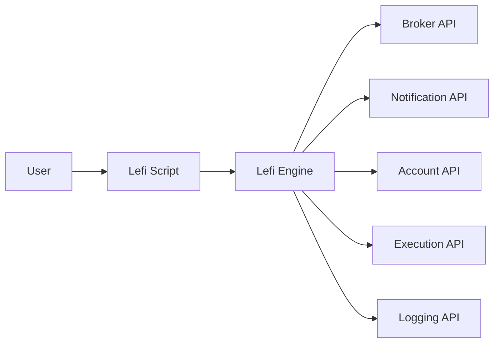

# Lefi: Architecture

## Overview

Lefi is a scripting language designed for financial automation. It provides a set of methods and keywords to automate tasks related to money management, such as executing transactions, sending notifications, and retrieving account information. The language is designed to be user-friendly and flexible, allowing users to define custom rules and workflows for their financial needs.

## Cloud Architecture

Lefi is designed to run in a cloud environment, allowing users to access their financial automation scripts from anywhere. A general cloud diagram for Lefi is exposed below (AWS):

