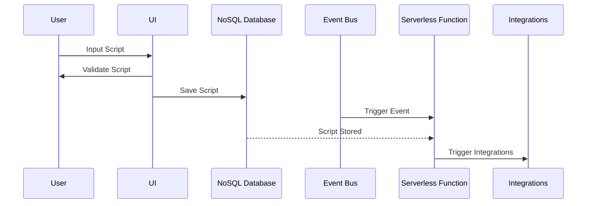
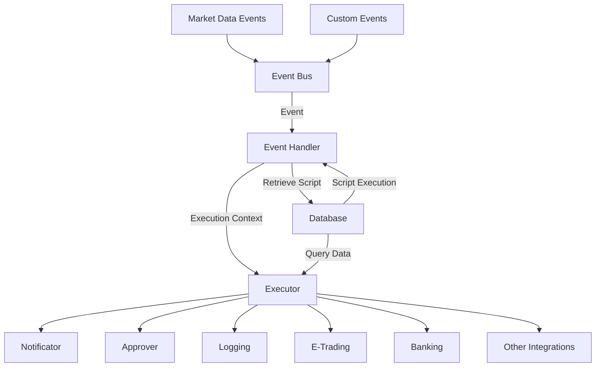

# Lefi: Architecture

## Overview

Lefi is a scripting language designed for financial automation. It provides a set of methods and keywords to automate tasks related to money management, such as executing transactions, sending notifications, and retrieving account information. The language is designed to be user-friendly and flexible, allowing users to define custom rules and workflows for their financial needs.

## Cloud Architecture

Lefi is designed to run in a cloud environment, allowing users to access their financial automation scripts from anywhere. A general flow of the architecture is as follows:

In this architecture, the user inputs a script through the user interface (UI), which is then validated and saved in a NoSQL database. An event bus triggers an serverless function, which executes the script and triggers integrations with external systems.

Many of the features of Lefi, such as error handling, approval workflows, and notifications, are implemented through integrations with external systems. For example, an approval system can be integrated to handle transactions that require manual or automated approval, while a notification system can be used to send real-time alerts to clients.

In the following diagram, we illustrate the flow of data and events in the Lefi architecture:

In this diagram, market data events and custom events are sent to an event bus, which triggers an event handler. The event handler retrieves the script from the database and passes it to an executor, which executes the script in the context of the event. The executor might interact with various integrations, such as a notificator, approver, compliance system, e-trading platform, banking system, or other external systems.

## Executor Design

One of the key components of the Lefi architecture is the executor, which is responsible for executing scripts in the context of events. Some key questions to consider when designing the executor include:

- **State Management**: Should the executor maintain state between same script executions? i.e., should it remember the state of the last execution? (e.g., for partial fulfillment of orders or pending approvals)

- **Error Handling**: How should the executor handle errors and exceptions in the script? Should it provide detailed error messages to the user? or should it retry the script execution?

- **Language**: What programming language should be used to implement the executor? Should it be a proper programming language like Python or JavaScript, so users can write complex scripts or should it be a customized scripting language for simplicity?

- **Security**: How should the executor handle sensitive information, such as user credentials or financial data? Should it encrypt data at rest and in transit? Should it implement rate limits to prevent misuse of the API?

- **Performance**: How should the executor handle large volumes of scripts and events? Should it be scalable to handle multiple concurrent executions? Should it cache results to improve performance?

- **Latency**: How should the executor handle latency in external integrations? Should it implement timeouts and retries for external calls? Should it provide real-time feedback to the user?
