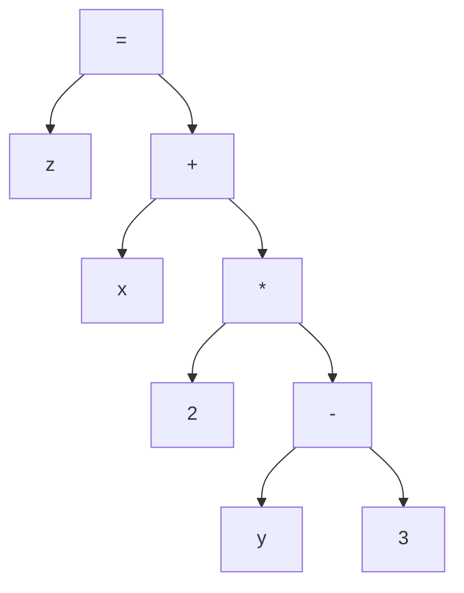

# Lefi: Code Evaluation

Code evaluation is the process of interpreting and executing code written in a scripting language. The code is parsed into an abstract syntax tree (AST) and then evaluated by traversing the tree and executing the nodes.

## Expression Trees

An expression tree is a tree data structure used to represent expressions in a programming language. Each node in the tree represents an operation or a value. The tree is evaluated by traversing the nodes and executing the operations.

An example is given below:

Imagine we are evaluating the following expression \( z = x + 2 \times (y - 3) \). This expression can be represented as a tree as follows:

If we traverse the tree and evaluate the nodes, from the leaves to the root, we will get the value of `z` at the root node.

## Nodes

In the context of Lefi, nodes are the building blocks of the abstract syntax tree (AST) that represents the code written in the scripting language. Each node corresponds to a specific operation or value in the code, such as a variable assignment, function call, or arithmetic operation.

Nodes can be classified into different types based on their functionality:

- **Definition nodes**: These nodes are used to define variables, strings, constants, and other entities in the code.
- **Mathematical operation nodes**: These nodes are used to perform arithmetic operations such as addition, subtraction, multiplication, and division.
- **Function call nodes**: These nodes are used to call functions defined in the code.
- **Logical operation nodes**: These nodes are used to perform logical operations such as AND, OR, and NOT.

## Visitors

Visitors implement specific operations on the nodes of the expression tree. They can be used to traverse the tree and perform actions based on the type of node encountered. There are two main types of visitors:

- **ConstVisitor**: This visitor is allowed to traverse the tree but not to modify it.
- **Visitor**: This visitor is used to evaluate the expression tree and compute the final result.

There are two main visitors in Lefi: the Indexer and the Evaluator.

### Indexer

The Indexer visitor is responsible for traversing the expression tree and building an index of variables and functions defined in the code. This index is used by the Evaluator visitor to resolve variable references and function calls during the evaluation process.

The Indexer is also in charge of defining what market data is needed in order to evaluate the script.

### Evaluator

The Evaluator visitor is responsible for traversing the expression tree and computing the final result of the expression. It uses the index built by the Indexer visitor to resolve variable references and function calls during the evaluation process.

The Evaluator executes the nodes in the order defined by the tree structure, ensuring that all operations are performed correctly and in the right sequence to produce the final output. This includes handling complex nested expressions, function calls, and interactions between different parts of the code.
